# PRD Técnico — Golozur Mobile

## Estado del documento

- **Tipo**: PRD técnico / arquitectura operativa
- **Estado**: Draft técnico verificable
- **Fecha**: 2026-04-15
- **Basado en**: implementación actual del repositorio
- **Formato visual**: diagramas Mermaid embebidos en Markdown

> Este documento describe CÓMO está construido el sistema móvil hoy, qué restricciones técnicas impone, dónde están sus riesgos reales y qué backlog técnico conviene priorizar. Para visión funcional del producto, ver `docs/PRD.md`.
>
> Si el visor de Markdown soporta Mermaid, los diagramas se renderizan. Si no, igual quedan legibles como fuente textual. Fantástico: documentación portable y técnica al mismo tiempo.

---

## 1. Objetivo técnico

Definir la arquitectura actual de Golozur Mobile, sus componentes, contratos implícitos, variables de entorno, flujos de datos, riesgos y prioridades técnicas para poder:

- mantener la app sin romper flujos críticos
- reducir deuda técnica en offline, sync y realtime
- facilitar onboarding técnico
- preparar futuras iteraciones con criterio arquitectónico

---

## 2. Visión técnica general del sistema

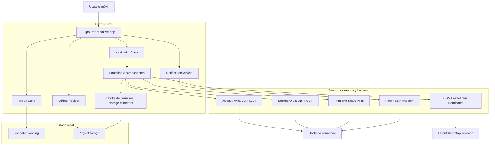
```mermaid
flowchart TD
    U[Usuario móvil] --> APP[Expo React Native App]

    subgraph MobileApp[Cliente móvil]
        APP --> NAV[NavigationStack]
        APP --> REDUX[Redux Store]
        APP --> OFFLINE[OfflineProvider]
        APP --> NOTIF[NotificationService]
        NAV --> SCREENS[Pantallas y componentes]
        SCREENS --> HOOKS[Hooks de permisos, storage e internet]
    end

    subgraph LocalState[Estado local]
        REDUX --> USERSTATE[user alert loading]
        OFFLINE --> ASYNC[AsyncStorage]
        HOOKS --> ASYNC
    end

    subgraph Backend[Servicios externos y backend]
        SCREENS --> API[Axios API via DB_HOST]
        SCREENS --> SOCKETS[Socket.IO via DB_HOST]
        NOTIF --> PING[Ping health endpoint]
        SCREENS --> PDF[Print and Share APIs]
        SCREENS --> MAPS[OSM Leaflet plus Nominatim]
    end

    API --> SERVER[Backend comercial]
    SOCKETS --> SERVER
    PDF --> SERVER
    PING --> SERVER
    MAPS --> OSM[OpenStreetMap services]
```

### Lectura rápida

- es una **single app Expo**
- la app mezcla **UI + lógica de integración** en muchas pantallas
- el estado operativo real vive repartido entre **Redux + AsyncStorage + backend + sockets**
- offline, sync y realtime existen, pero no están centralizados en una sola capa

---

## 3. Stack técnico actual

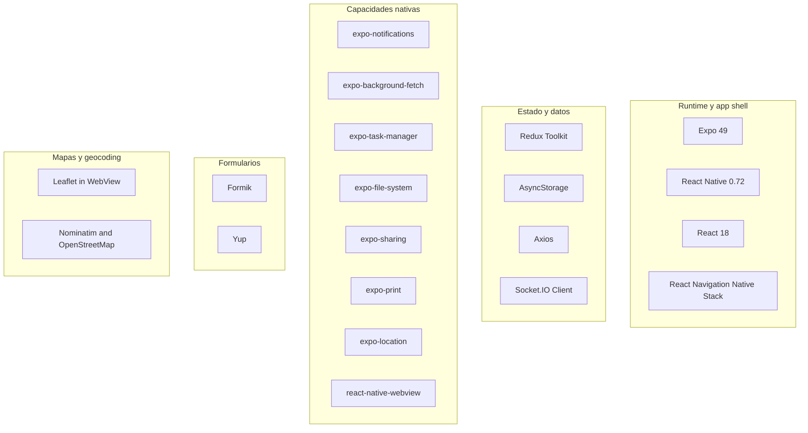
```mermaid
flowchart TB
    subgraph Runtime[Runtime y app shell]
        EXPO[Expo 49]
        RN[React Native 0.72]
        REACT[React 18]
        NAV[React Navigation Native Stack]
    end

    subgraph StateData[Estado y datos]
        REDUX[Redux Toolkit]
        ASYNC[AsyncStorage]
        AXIOS[Axios]
        SOCKET[Socket.IO Client]
    end

    subgraph NativeUX[Capacidades nativas]
        NOTIF[expo-notifications]
        BG[expo-background-fetch]
        TASK[expo-task-manager]
        FS[expo-file-system]
        SHARE[expo-sharing]
        PRINT[expo-print]
        LOC[expo-location]
        WEBVIEW[react-native-webview]
    end

    subgraph Forms[Formularios]
        FORMIK[Formik]
        YUP[Yup]
    end

    subgraph Mapping[Mapas y geocoding]
        LEAFLET[Leaflet in WebView]
        OSM[Nominatim and OpenStreetMap]
    end
```

### Observación técnica importante

- `react-native-maps` está instalado, pero el flujo de ubicación verificado hoy usa **WebView + Leaflet + OpenStreetMap/Nominatim**, no `MapView`.

---

## 4. Estructura real de la app

### 4.1 Composición raíz

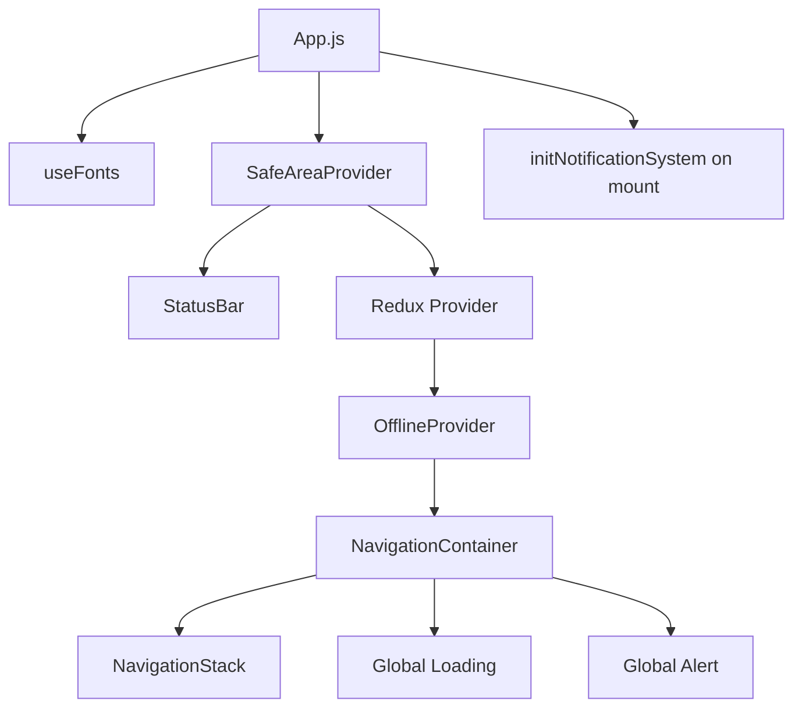
```mermaid
flowchart TD
    ENTRY[App.js] --> FONTS[useFonts]
    ENTRY --> SAFE[SafeAreaProvider]
    SAFE --> STATUS[StatusBar]
    SAFE --> PROVIDER[Redux Provider]
    PROVIDER --> OFFLINE[OfflineProvider]
    OFFLINE --> NAVC[NavigationContainer]
    NAVC --> STACK[NavigationStack]
    NAVC --> LOADING[Global Loading]
    NAVC --> ALERT[Global Alert]
    ENTRY --> INIT[initNotificationSystem on mount]
```

### 4.2 Navegación efectiva

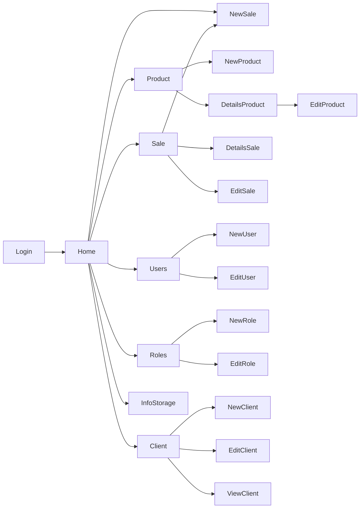
```mermaid
flowchart LR
    LOGIN[Login] --> HOME[Home]
    HOME --> PRODUCT[Product]
    HOME --> SALE[Sale]
    HOME --> USERS[Users]
    HOME --> ROLES[Roles]
    HOME --> CLIENT[Client]
    HOME --> STORAGE[InfoStorage]
    HOME --> NEWSALE[NewSale]

    PRODUCT --> NEWPRODUCT[NewProduct]
    PRODUCT --> DETAILPRODUCT[DetailsProduct]
    DETAILPRODUCT --> EDITPRODUCT[EditProduct]

    SALE --> DETAILSALE[DetailsSale]
    SALE --> EDITSALE[EditSale]
    SALE --> NEWSALE

    USERS --> NEWUSER[NewUser]
    USERS --> EDITUSER[EditUser]

    ROLES --> NEWROLE[NewRole]
    ROLES --> EDITROLE[EditRole]

    CLIENT --> NEWCLIENT[NewClient]
    CLIENT --> EDITCLIENT[EditClient]
    CLIENT --> VIEWCLIENT[ViewClient]
```

### 4.3 Observaciones estructurales

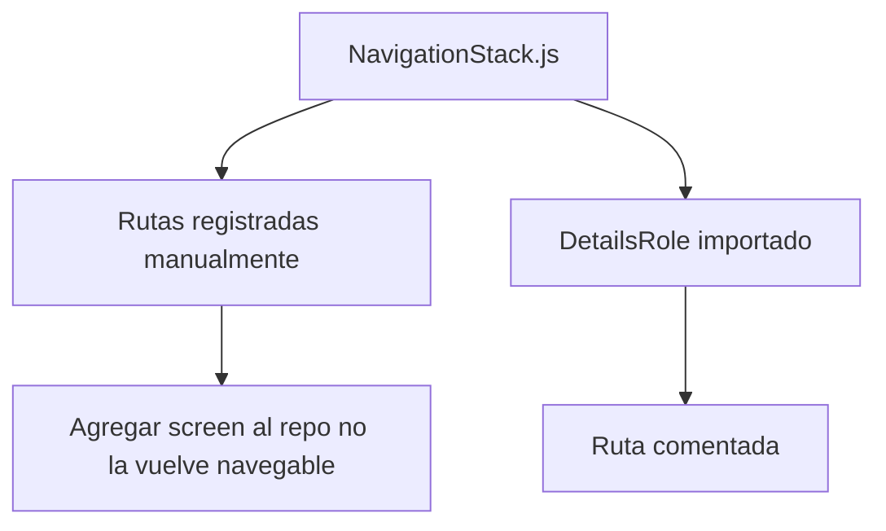
```mermaid
flowchart TD
    A[NavigationStack.js] --> B[Rutas registradas manualmente]
    B --> C[Agregar screen al repo no la vuelve navegable]
    A --> D[DetailsRole importado]
    D --> E[Ruta comentada]
```

### Módulos activos hoy

- `Login`
- `Home`
- `Product`, `NewProduct`, `EditProduct`, `DetailsProduct`
- `Sale`, `NewSale`, `EditSale`, `DetailsSale`
- `Client`, `NewClient`, `EditClient`, `ViewClient`
- `Users`, `NewUser`, `EditUser`
- `Roles`, `NewRole`, `EditRole`
- `InfoStorage`

---

## 5. Configuración runtime

### 5.1 Flujo de variables de entorno

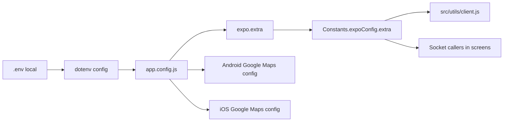
```mermaid
flowchart LR
    ENV[.env local] --> DOTENV[dotenv config]
    DOTENV --> APPCONFIG[app.config.js]
    APPCONFIG --> EXTRA[expo.extra]
    EXTRA --> CONSTANTS[Constants.expoConfig.extra]

    CONSTANTS --> API[src/utils/client.js]
    CONSTANTS --> SOCKETS[Socket callers in screens]
    APPCONFIG --> ANDROID[Android Google Maps config]
    APPCONFIG --> IOS[iOS Google Maps config]
```

### 5.2 Variables realmente cableadas hoy

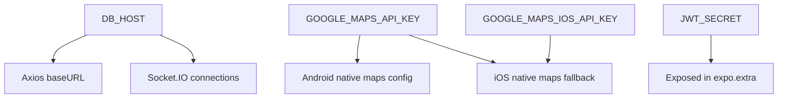
```mermaid
flowchart TD
    DBHOST[DB_HOST] --> AX[Axios baseURL]
    DBHOST --> SO[Socket.IO connections]

    GMAPS[GOOGLE_MAPS_API_KEY] --> ANDR[Android native maps config]
    GIOS[GOOGLE_MAPS_IOS_API_KEY] --> IOSCFG[iOS native maps fallback]
    GMAPS --> IOSCFG

    JWT[JWT_SECRET] --> EXTRAONLY[Exposed in expo.extra]
```

### 5.3 Observaciones importantes

- `DB_HOST` sí se usa activamente en cliente para API y sockets.
- `GOOGLE_MAPS_API_KEY` y `GOOGLE_MAPS_IOS_API_KEY` se usan en config nativa Expo.
- `JWT_SECRET` está expuesto por config, pero no se observó uso directo del lado cliente en el código inspeccionado.

---

## 6. `.env.example`

### 6.1 Variables documentadas

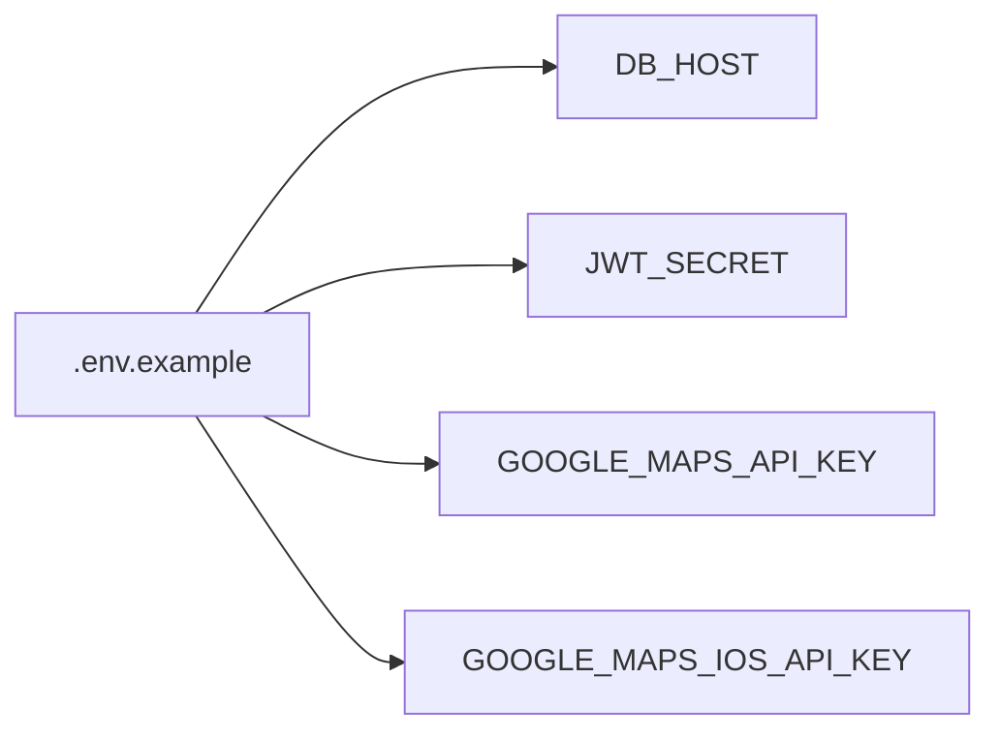
```mermaid
flowchart LR
    EXAMPLE[.env.example] --> DBHOST[DB_HOST]
    EXAMPLE --> JWT[JWT_SECRET]
    EXAMPLE --> GMAPS[GOOGLE_MAPS_API_KEY]
    EXAMPLE --> GIOS[GOOGLE_MAPS_IOS_API_KEY]
```

### 6.2 Qué queda fuera del env actual

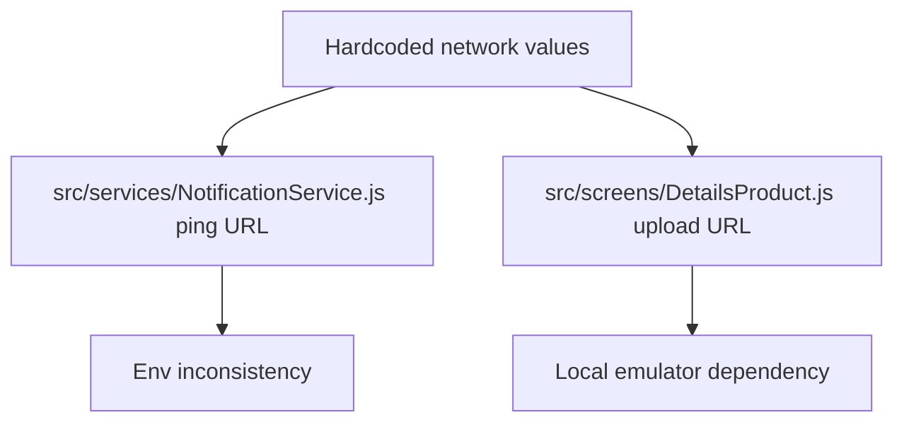
```mermaid
flowchart TD
    HARDCODED[Hardcoded network values] --> PING[src/services/NotificationService.js ping URL]
    HARDCODED --> UPLOAD[src/screens/DetailsProduct.js upload URL]
    PING --> RISK1[Env inconsistency]
    UPLOAD --> RISK2[Local emulator dependency]
```

### Nota técnica crítica

Poner esos valores hardcodeados dentro de `.env.example` sin refactor previo sería MENTIR. Así que no: el `.env.example` documenta solo lo que hoy está realmente cableado por `app.config.js`.

---

## 7. Arquitectura de datos

### 7.1 Vista de alto nivel

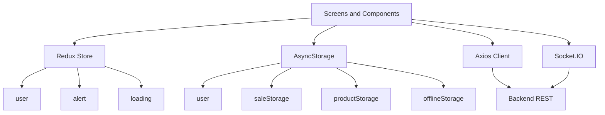
```mermaid
flowchart TD
    UI[Screens and Components] --> REDUX[Redux Store]
    UI --> STORAGE[AsyncStorage]
    UI --> API[Axios Client]
    UI --> SOCKET[Socket.IO]

    API --> BACKEND[Backend REST]
    SOCKET --> BACKEND

    REDUX --> USER[user]
    REDUX --> ALERT[alert]
    REDUX --> LOAD[loading]

    STORAGE --> USERSTORE[user]
    STORAGE --> SALESTORE[saleStorage]
    STORAGE --> PRODUCTSTORE[productStorage]
    STORAGE --> OFFLINESTORE[offlineStorage]
```

### 7.2 Token y autenticación para requests

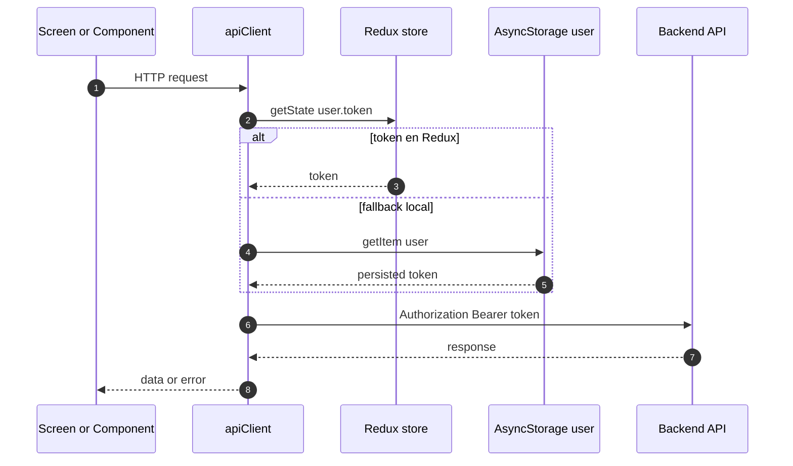
```mermaid
sequenceDiagram
    autonumber
    participant Screen as Screen or Component
    participant Axios as apiClient
    participant Redux as Redux store
    participant Storage as AsyncStorage user
    participant API as Backend API

    Screen->>Axios: HTTP request
    Axios->>Redux: getState user.token
    alt token en Redux
        Redux-->>Axios: token
    else fallback local
        Axios->>Storage: getItem user
        Storage-->>Axios: persisted token
    end
    Axios->>API: Authorization Bearer token
    API-->>Axios: response
    Axios-->>Screen: data or error
```

### 7.3 Contrato de almacenamiento local

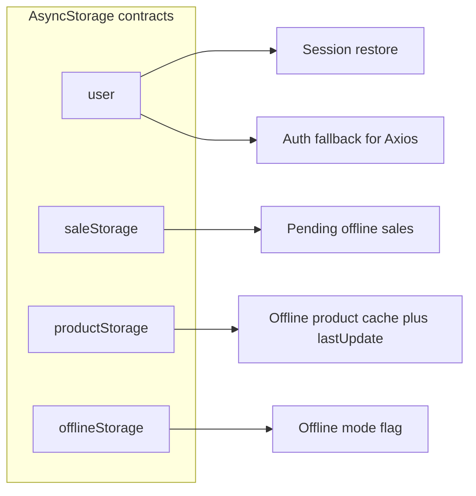
```mermaid
flowchart LR
    subgraph AsyncStorageContracts[AsyncStorage contracts]
        USER[user]
        SALE[saleStorage]
        PRODUCT[productStorage]
        OFFLINE[offlineStorage]
    end

    USER --> RESTORE[Session restore]
    USER --> AUTHFALLBACK[Auth fallback for Axios]
    SALE --> PEND[Pending offline sales]
    PRODUCT --> CACHE[Offline product cache plus lastUpdate]
    OFFLINE --> FLAG[Offline mode flag]
```

### Riesgo

No renombrar ni cambiar la forma de estas claves sin tocar todo el flujo. Se te rompe medio sistema, hermano.

---

## 8. Arquitectura offline y sincronización

### 8.1 Componentes involucrados

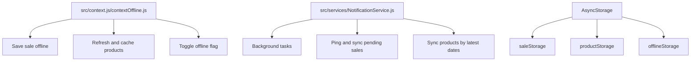
```mermaid
flowchart TD
    CONTEXT[src/context.js/contextOffline.js] --> SALESAVE[Save sale offline]
    CONTEXT --> PRODUCTCACHE[Refresh and cache products]
    CONTEXT --> FLAG[Toggle offline flag]

    NOTIF[src/services/NotificationService.js] --> BGTASKS[Background tasks]
    NOTIF --> PINGSYNC[Ping and sync pending sales]
    NOTIF --> PRODUCTSYNC[Sync products by latest dates]

    STORAGE[AsyncStorage] --> SALEST[saleStorage]
    STORAGE --> PRODUCTST[productStorage]
    STORAGE --> OFFST[offlineStorage]
```

### 8.2 Flujo de venta con fallback offline

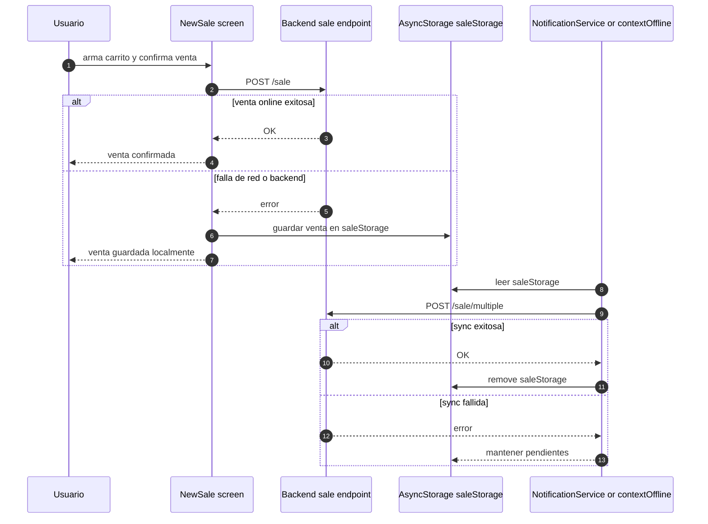
```mermaid
sequenceDiagram
    autonumber
    participant User as Usuario
    participant NewSale as NewSale screen
    participant API as Backend sale endpoint
    participant Storage as AsyncStorage saleStorage
    participant Sync as NotificationService or contextOffline

    User->>NewSale: arma carrito y confirma venta
    NewSale->>API: POST /sale
    alt venta online exitosa
        API-->>NewSale: OK
        NewSale-->>User: venta confirmada
    else falla de red o backend
        API-->>NewSale: error
        NewSale->>Storage: guardar venta en saleStorage
        NewSale-->>User: venta guardada localmente
    end

    Sync->>Storage: leer saleStorage
    Sync->>API: POST /sale/multiple
    alt sync exitosa
        API-->>Sync: OK
        Sync->>Storage: remove saleStorage
    else sync fallida
        API-->>Sync: error
        Sync-->>Storage: mantener pendientes
    end
```

### 8.3 Estado de una venta offline

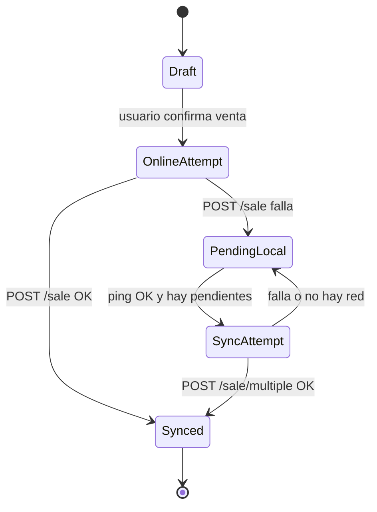
```mermaid
stateDiagram-v2
    [*] --> Draft
    Draft --> OnlineAttempt: usuario confirma venta
    OnlineAttempt --> Synced: POST /sale OK
    OnlineAttempt --> PendingLocal: POST /sale falla
    PendingLocal --> SyncAttempt: ping OK y hay pendientes
    SyncAttempt --> Synced: POST /sale/multiple OK
    SyncAttempt --> PendingLocal: falla o no hay red
    Synced --> [*]
```

### 8.4 Estado actual del soporte offline

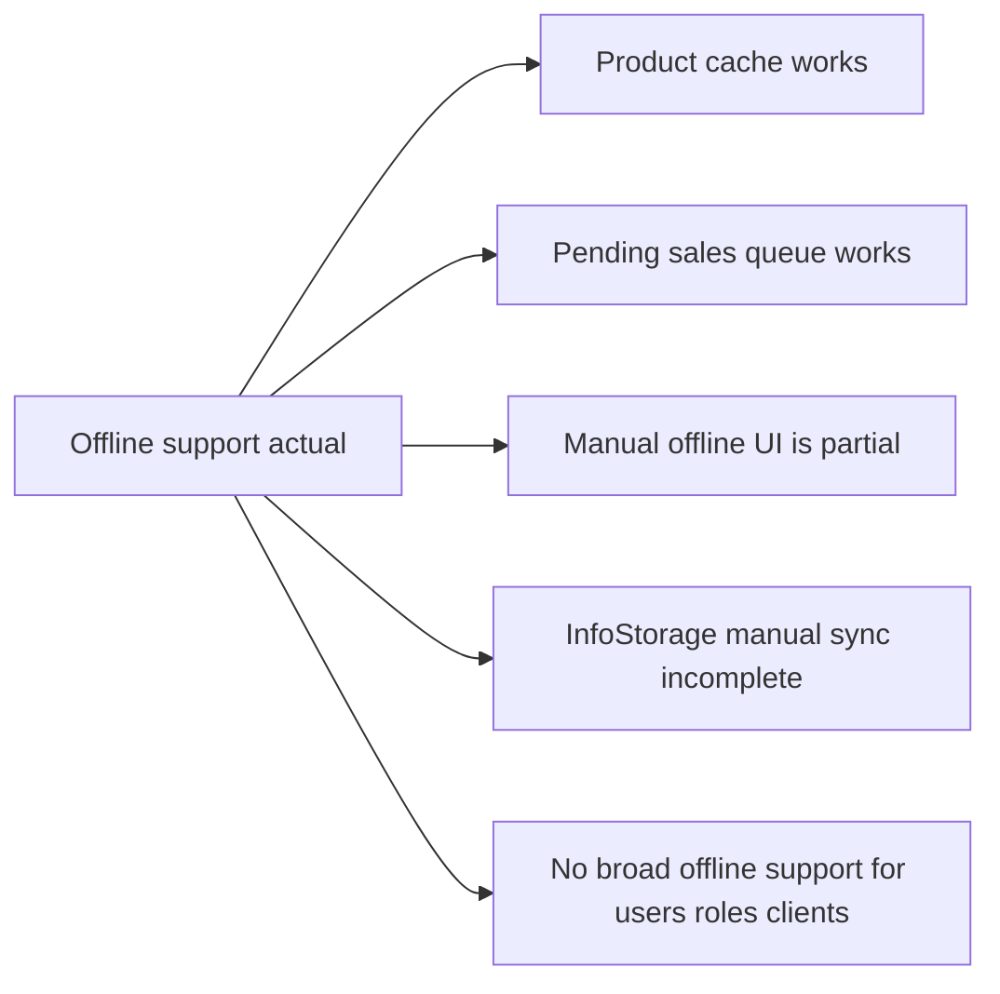
```mermaid
flowchart LR
    OFFLINE[Offline support actual] --> OK1[Product cache works]
    OFFLINE --> OK2[Pending sales queue works]
    OFFLINE --> PART1[Manual offline UI is partial]
    OFFLINE --> PART2[InfoStorage manual sync incomplete]
    OFFLINE --> MISS[No broad offline support for users roles clients]
```

### Observación técnica

- el archivo efectivo para background sync es `NotificationService.js`
- `setupBackgroundFetch.js` existe, pero no es la implementación activa del flujo real

---

## 9. Arquitectura realtime

### 9.1 Topología actual

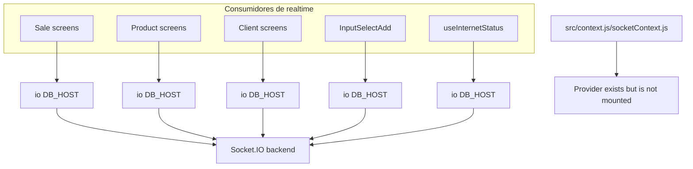
```mermaid
flowchart TD
    subgraph ScreensAndHooks[Consumidores de realtime]
        SALE[Sale screens]
        PROD[Product screens]
        CLIENT[Client screens]
        INPUT[InputSelectAdd]
        INTERNET[useInternetStatus]
    end

    SALE --> SOCK1[io DB_HOST]
    PROD --> SOCK2[io DB_HOST]
    CLIENT --> SOCK3[io DB_HOST]
    INPUT --> SOCK4[io DB_HOST]
    INTERNET --> SOCK5[io DB_HOST]

    SOCK1 --> SERVER[Socket.IO backend]
    SOCK2 --> SERVER
    SOCK3 --> SERVER
    SOCK4 --> SERVER
    SOCK5 --> SERVER

    PROVIDER[src/context.js/socketContext.js] --> UNUSED[Provider exists but is not mounted]
```

### 9.2 Consecuencia de diseño

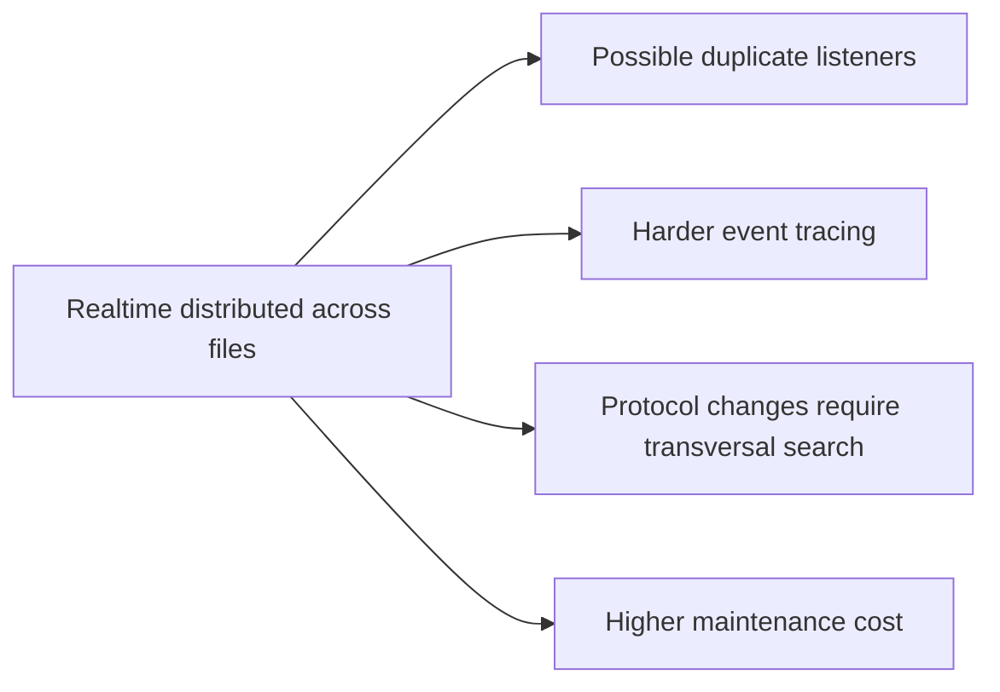
```mermaid
flowchart LR
    DISTRIB[Realtime distributed across files] --> DUP[Possible duplicate listeners]
    DISTRIB --> TRACE[Harder event tracing]
    DISTRIB --> CHANGE[Protocol changes require transversal search]
    DISTRIB --> COST[Higher maintenance cost]
```

### Eventos observados

- `sale`
- `product`
- `client_location`
- eventos específicos por path en componentes como `InputSelectAdd`

---

## 10. Arquitectura de permisos y seguridad

### 10.1 Flujo de verificación de permisos

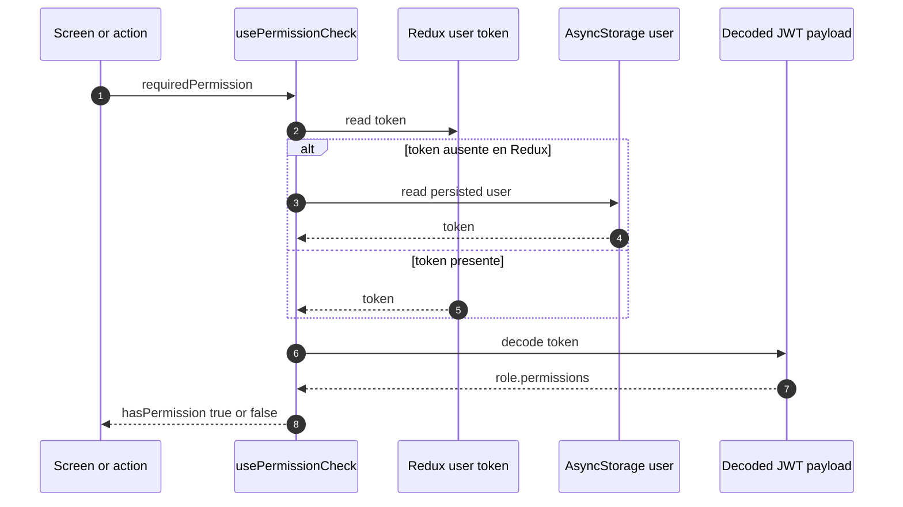
```mermaid
sequenceDiagram
    autonumber
    participant Screen as Screen or action
    participant Hook as usePermissionCheck
    participant Redux as Redux user token
    participant Storage as AsyncStorage user
    participant JWT as Decoded JWT payload

    Screen->>Hook: requiredPermission
    Hook->>Redux: read token
    alt token ausente en Redux
        Hook->>Storage: read persisted user
        Storage-->>Hook: token
    else token presente
        Redux-->>Hook: token
    end
    Hook->>JWT: decode token
    JWT-->>Hook: role.permissions
    Hook-->>Screen: hasPermission true or false
```

### 10.2 Modelo de permisos

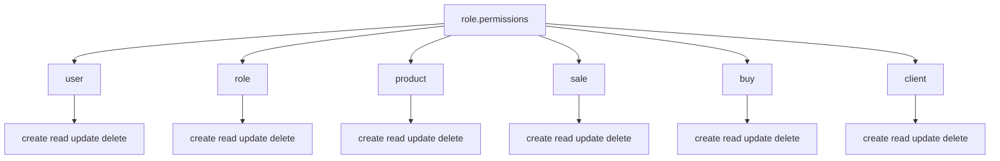
```mermaid
flowchart TD
    ROLE[role.permissions] --> USERP[user]
    ROLE --> ROLEP[role]
    ROLE --> PRODUCTP[product]
    ROLE --> SALEP[sale]
    ROLE --> BUYP[buy]
    ROLE --> CLIENTP[client]

    USERP --> C1[create read update delete]
    ROLEP --> C2[create read update delete]
    PRODUCTP --> C3[create read update delete]
    SALEP --> C4[create read update delete]
    BUYP --> C5[create read update delete]
    CLIENTP --> C6[create read update delete]
```

### 10.3 Riesgo de seguridad técnica

```mermaid
flowchart LR
    UIGATE[UI permission gating] --> GOOD[Improves UX and reduces wrong actions]
    UIGATE --> LIMIT[Does not replace backend authorization]
    JWTDEC[JWT decoded on client] --> COUPLING[Client coupled to token shape]
```

### Observación importante

- `buy` existe en permisos, pero no se verificó módulo UI de compras.

---

## 11. Geolocalización y mapas

### 11.1 Flujo técnico actual

```mermaid
sequenceDiagram
    autonumber
    participant User as Usuario
    participant Picker as ClienteLocationPicker
    participant Perm as expo-location permissions
    participant Device as Device location API
    participant WebView as Leaflet WebView
    participant Nominatim as Nominatim reverse geocode
    participant Parent as NewClient or EditClient

    User->>Picker: abre selector
    Picker->>Perm: requestForegroundPermissionsAsync
    alt permiso otorgado
        Picker->>Device: getLastKnownPosition or getCurrentPosition
        Device-->>Picker: coords
        Picker->>WebView: set marker
    else permiso denegado
        Picker-->>User: seleccionar manualmente
    end

    User->>WebView: tap or long press map
    WebView-->>Picker: lat lng
    Picker->>Nominatim: reverse geocode
    Nominatim-->>Picker: address
    Picker-->>Parent: lat lng address
```

### 11.2 Arquitectura del módulo de ubicación

```mermaid
flowchart TD
    PICKER[ClienteLocationPicker] --> WEB[WebView with Leaflet]
    PICKER --> PERM[askLocationPermission]
    PICKER --> COORDS[getCurrentCoords]
    PICKER --> GEO[reverseGeocode]
    GEO --> NOM[Nominatim]
    WEB --> OSM[OpenStreetMap tiles]
    PICKER --> PARENT[Client forms and views]
```

### 11.3 Tradeoffs

```mermaid
flowchart LR
    CURRENT[WebView plus Leaflet approach] --> PRO1[Portable inside Expo]
    CURRENT --> PRO2[Works with OSM ecosystem]
    CURRENT --> CONS1[Depends on WebView runtime]
    CURRENT --> CONS2[Depends on external geocoding service]
    CURRENT --> CONS3[Adds indirection versus native map kit]
```

---

## 12. Documentos y archivos

### 12.1 Pipeline de PDF y compartición

```mermaid
sequenceDiagram
    autonumber
    participant User as Usuario
    participant Screen as Sale or Product flow
    participant API as Backend print endpoint
    participant FS as expo-file-system
    participant Share as expo-sharing

    User->>Screen: solicita imprimir o compartir
    Screen->>API: request arraybuffer PDF
    API-->>Screen: binary response
    Screen->>FS: write base64 file
    FS-->>Screen: file URI
    Screen->>Share: shareAsync file URI
    Share-->>User: native share sheet
```

### 12.2 Vista técnica por dominio

```mermaid
flowchart LR
    SALEPDF[Sale PDF generation] --> SALEEND[GET sale print endpoint]
    PRODUCTPDF[Product price list PDF] --> PRODEND[POST product print endpoints]
    SALEPDF --> FS[FileSystem]
    PRODUCTPDF --> FS
    FS --> SHARE[Sharing]
```

---

## 13. Build, release y operación local

### 13.1 Flujos de ejecución y build

```mermaid
flowchart TD
    DEV[Desarrollo local] --> START[npm start]
    DEV --> GO[npm run dev]
    DEV --> ANDROID[npm run android]
    DEV --> IOS[npm run ios]
    DEV --> WEB[npm run web]

    RELEASE[Build Android] --> BUILD[npm run build]
    BUILD --> EAS[eas.json default production]
    EAS --> PROD[production apk]
    EAS --> PREVIEW[preview apk]
    EAS --> PREVIEW2[preview2 gradle release]
    EAS --> DEVCLIENT[development internal client]
```

### 13.2 Estado de calidad automatizada

```mermaid
flowchart LR
    REPO[Current repo] --> NO1[No lint script]
    REPO --> NO2[No test script]
    REPO --> NO3[No format script]
    REPO --> NO4[No typecheck script]
    REPO --> NO5[No CI workflows]
    NO1 --> MANUAL[Verification is mostly manual]
    NO2 --> MANUAL
    NO3 --> MANUAL
    NO4 --> MANUAL
    NO5 --> MANUAL
```

---

## 14. Contratos y endpoints observados

### 14.1 Mapa de dominios a endpoints

```mermaid
flowchart TD
    APP[Mobile app] --> AUTH[Auth]
    APP --> PRODUCT[Products]
    APP --> SALE[Sales]
    APP --> CLIENT[Clients]
    APP --> USER[Users]
    APP --> ROLE[Roles]
    APP --> AUX[Aux catalogs]

    AUTH --> A1[POST auth login]
    AUTH --> A2[POST auth register]

    PRODUCT --> P1[POST product skip]
    PRODUCT --> P2[POST product search]
    PRODUCT --> P3[GET product]
    PRODUCT --> P4[GET product id]
    PRODUCT --> P5[PATCH product id]
    PRODUCT --> P6[PATCH product]
    PRODUCT --> P7[GET product latest dates]
    PRODUCT --> P8[POST product print]
    PRODUCT --> P9[POST product print with discount]

    SALE --> S1[POST sale]
    SALE --> S2[POST sale skip]
    SALE --> S3[POST sale search]
    SALE --> S4[POST sale multiple]
    SALE --> S5[GET sale id]
    SALE --> S6[DELETE sale id]
    SALE --> S7[GET sale print id]

    CLIENT --> C1[POST client]
    CLIENT --> C2[PATCH client id]
    CLIENT --> C3[GET client id]
    CLIENT --> C4[POST client skip]
    CLIENT --> C5[POST client search]

    USER --> U1[GET user get all]
    USER --> U2[GET user id]
    USER --> U3[POST user skip]
    USER --> U4[POST user search]
    USER --> U5[PATCH user id]

    ROLE --> R1[GET role]
    ROLE --> R2[GET role id]
    ROLE --> R3[POST role]
    ROLE --> R4[POST role skip]
    ROLE --> R5[POST role search]
    ROLE --> R6[PATCH role id]

    AUX --> X1[GET categorie]
    AUX --> X2[GET brand]
    AUX --> X3[GET provider]
```

### 14.2 Observación de contratos implícitos

```mermaid
flowchart LR
    PRODUCTSTORE[productStorage requires product plus lastUpdate] --> PRODUCTSYNC[Product sync logic]
    USERSTRUCT[user object requires token and fields used by screens] --> AUTHFLOW[Auth and permissions]
    SALEBATCH[saleStorage as array] --> BATCHPOST[POST sale multiple]
```

---

## 15. Riesgos técnicos reales

### 15.1 Mapa de riesgo

```mermaid
flowchart TD
    RISK[Technical risk map] --> NET[Network config inconsistency]
    RISK --> RT[Distributed realtime]
    RISK --> OFF[Partial offline]
    RISK --> TYPES[Partial typing]
    RISK --> SECRET[Unneeded exposed secret]
    RISK --> QA[No automated verification]

    NET --> NET1[DB_HOST for API and sockets]
    NET --> NET2[Hardcoded Render ping]
    NET --> NET3[Hardcoded 10.0.2.2 upload]

    RT --> RT1[Many io DB_HOST instances]
    RT --> RT2[Harder maintenance]
    RT --> RT3[Possible duplicate listeners]

    OFF --> OFF1[Products and sales yes]
    OFF --> OFF2[Users roles clients not broadly offline]
    OFF --> OFF3[Manual sync UX incomplete]

    TYPES --> TY1[tsconfig exists]
    TYPES --> TY2[Most product code is JS]

    SECRET --> SC1[JWT_SECRET exposed in expo extra]

    QA --> QA1[No tests]
    QA --> QA2[No CI]
```

### 15.2 Impacto técnico

```mermaid
flowchart LR
    NET[Network inconsistency] --> PROD[Environment-dependent failures]
    RT[Realtime sprawl] --> MAINT[Higher maintenance cost]
    OFF[Partial offline] --> OPS[Operational ambiguity]
    SECRET[Client-exposed secret] --> SEC[Security review needed]
    QA[No automation] --> REG[Higher regression risk]
```

---

## 16. Decisiones técnicas recomendadas

```mermaid
flowchart TD
    START[Technical priorities] --> P1[Centralize runtime config]
    START --> P2[Centralize socket strategy]
    START --> P3[Formalize offline sync state]
    START --> P4[Review secrets exposed in client]
    START --> P5[Increase typing on critical contracts]
    START --> P6[Extract domain services from screens]
    START --> P7[Add minimum automated validation]

    P1 --> P1A[Move ping and upload URLs to config]
    P2 --> P2A[Single socket lifecycle]
    P3 --> P3A[Pending syncing failed lastSynced state]
    P4 --> P4A[Review JWT_SECRET necessity]
    P5 --> P5A[Type storage DTOs and API DTOs]
    P6 --> P6A[Sales products clients domain services]
    P7 --> P7A[Smoke scripts and checks]
```

### Prioridad alta

- centralizar configuración de endpoints
- centralizar estrategia realtime
- formalizar sync offline
- eliminar config sensible innecesaria del cliente

### Prioridad media

- subir tipado progresivo
- separar capa de dominio de capa UI
- diseñar estrategia de validación mínima automatizada

---

## 17. Backlog técnico propuesto

```mermaid
flowchart LR
    F1[Fase 1 Hardening runtime] --> F1A[config runtime ts]
    F1 --> F1B[remove hardcoded ping upload]
    F1 --> F1C[review JWT_SECRET in client]
    F1 --> F1D[document storage contracts]

    F2[Fase 2 Realtime y sync] --> F2A[single socket layer]
    F2 --> F2B[migrate listeners to services hooks]
    F2 --> F2C[complete InfoStorage manual sync]
    F2 --> F2D[observable sync state]

    F3[Fase 3 Mantenibilidad] --> F3A[extract domain services]
    F3 --> F3B[type critical DTOs]
    F3 --> F3C[add validation scripts]
    F3 --> F3D[improve screen composition]
```

### Dependencia entre fases

```mermaid
flowchart TD
    F1[Phase 1] --> F2[Phase 2]
    F2 --> F3[Phase 3]
    F1 --> BASIS[Stable runtime foundation]
    BASIS --> F2
    F2 --> OPS[More reliable sync and realtime]
    OPS --> F3
```

---

## 18. Archivos clave para onboarding técnico

```mermaid
flowchart TD
    ROOT[Root onboarding map] --> APPJS[App.js]
    ROOT --> APPCFG[app.config.js]
    ROOT --> NAV[src/navigation/NavigationStack.js]
    ROOT --> CLIENT[src/utils/client.js]
    ROOT --> OFFCTX[src/context.js/contextOffline.js]
    ROOT --> NOTIF[src/services/NotificationService.js]
    ROOT --> PERM[src/hooks/usePermissionCheck.js]
    ROOT --> PICKER[src/components/ClienteLocationPicker.js]
    ROOT --> PRINTP[src/components/PrintProduct.js]
    ROOT --> SALECORE[sale screens]

    APPJS --> COMPOSE[Root composition]
    APPCFG --> ENV[Runtime config and env]
    NAV --> ROUTES[Effective routes]
    CLIENT --> HTTP[HTTP and auth fallback]
    OFFCTX --> OFFSYNC[Offline queue and product cache]
    NOTIF --> BGSYNC[Background sync]
    PERM --> GATE[Permission gating]
    PICKER --> MAPFLOW[Map stack]
    PRINTP --> PDFSTACK[Product PDF pipeline]
    SALECORE --> CORE[Critical business workflow]
```

---

## 19. Cierre técnico

```mermaid
flowchart TD
    NOW[Current app] --> WORKS[It solves a real mobile commercial workflow]
    NOW --> DEBT[It carries distributed architectural debt]

    DEBT --> RUNTIME[Runtime inconsistency]
    DEBT --> SYNC[Partial sync formalization]
    DEBT --> REALTIME[Decentralized realtime]
    DEBT --> QA[Manual verification burden]

    RUNTIME --> NEXT[Stabilize foundations first]
    SYNC --> NEXT
    REALTIME --> NEXT
    QA --> NEXT

    NEXT --> SCALE[Then scale features with lower risk]
```

La app no está “mal” por funcionar con varias piezas distribuidas. El problema aparece cuando alguien quiere cambiar algo sin entender la estructura. Y ahí es donde la arquitectura te cobra intereses.

La prioridad técnica NO debería ser “meter más features porque sí”.

La prioridad real es:

- consolidar runtime
- ordenar sync offline
- centralizar realtime
- bajar riesgo operacional

Después de eso, sí: escalar módulos y producto con fundamentos sólidos.

Eso es arquitectura. Lo otro es pegar ladrillos sin planos.
